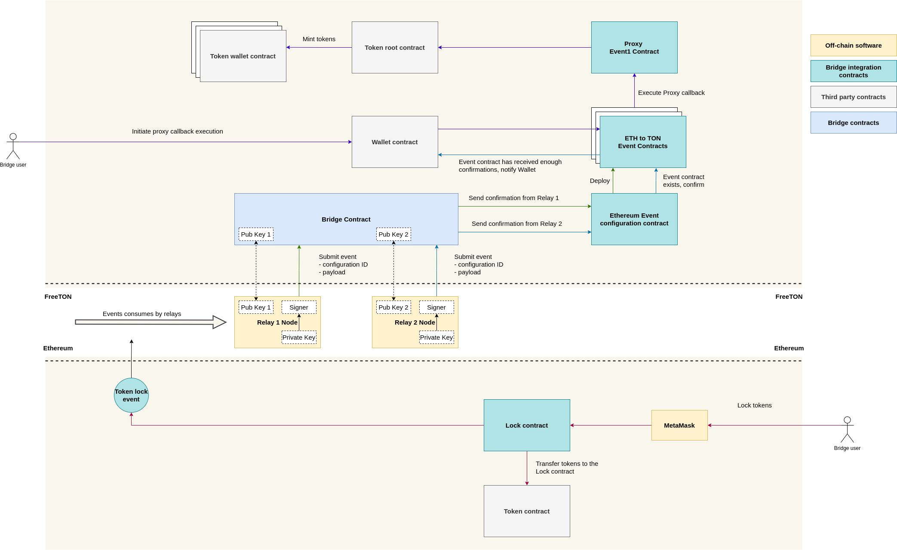

# Broxus FT-Ethereum bridge architecture

This document describes the key components and the architecture of the bridge.
Smart contracts specification can be found [here](./../specification.md).

As an example of how the bridge works on practice, the cross-chain token transfers scheme is described bellow.

## Event flow

### Ethereum-FT

### FT-Ethereum

## Components

### Relays

Relays are responsible for the functioning of the bridge. Each relay has an Ethereum and FreeTON keypair, which are used for
signing all sensitive actions, such as confirming event, rejecting event, voting for new relay, etc.

Each relay runs a relay node, which is doing all the job:

- Monitor supported events in Ethereum and FT
- Confirm new events
- Monitor another relays submitting malicious transactions and reject them

The relay node is written in Rust and open source ([repo](https://github.com/broxus/ton-eth-bridge-relay)).

### Smart contracts

Smart contracts handle a process of event specification and building consensus between relays in the confirmation process.
Specification of the contracts can be found [here](./../specification.md).

## Why FT?

The bridge requires a lot of technical transactions to be send. Each relay has to confirm / reject every event supported by the bridge.
Since the Ethereum is expensive, it is not suitable for such a task. That's why most of the interactions are happening in FT.
The Ethereum is used only as a settlement layer for Ethereum specific operations.
