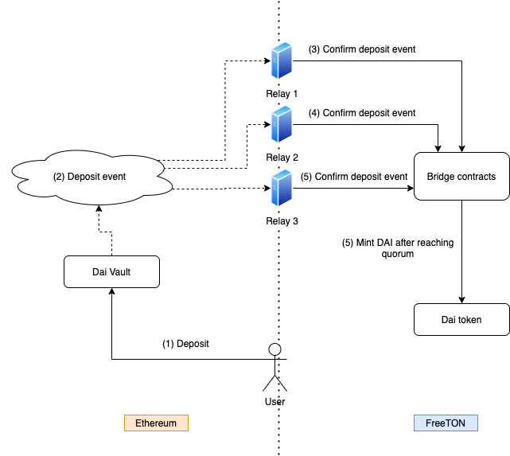
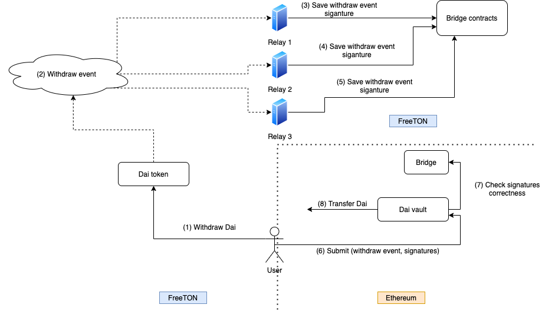
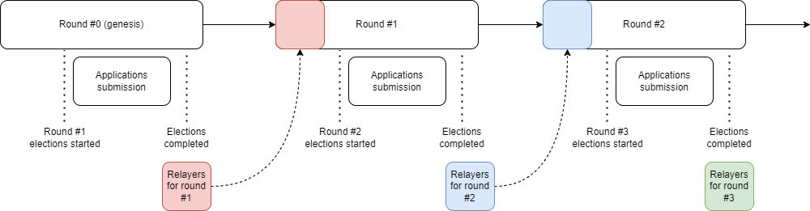
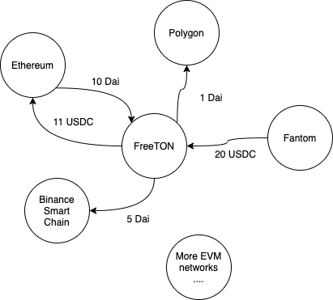

# Abstract

This document is a simplified version of White Paper for TON bridge V2. The following describes both the basic functionality of the bridge V2 and emerging features of this product, such as Bridge* token staking; relay auction, which allows stakeholders to become relays; connection of any EVM**-compatible blockchains; liquidity management on the EVM side with subsequent buyback of Bridge tokens and their distribution among stakeholders; bridge V2 management using DAO, with the possibility of creating cross-chain proposals. This document is not technical and does not cover actual implementation of the product, but rather gives an idea of the capabilities of TON bridge V2.

\* The Bridge token is a token in the FreeTON network, and the bridge is a protocol that transfers events between EVM networks and FreeTON

\** EVM stands for Ethereum Virtual Machine. Examples of EVM compatible blockchains are Ethereum, Binance Smart Chain, Polygon, Fantom, xDai, and so on

# Introduction

TON bridge V1 is a bridge between Ethereum and FreeTON. First, the bridge supports the transfer of tokens between Ethereum and FreeTON. 20 Ethereum tokens are connected to TON bridge V1, including USDT, DAI, USDC, WBTC, WETH, WTON\* etc. The TVL for all tokens exceeds $ 30.5 million.

The first version of the TON bridge was significantly centralized - events were confirmed by a group of three relays. The possibility of adding external relays was especially limited in order to minimize risks in the early days of the project. All administrative functions were in the hands of a multisignature wallet, controlled by the Broxus team.

After six months of successful operation we are now launching a new, significantly expanded version - TON bridge V2.

\* Wrapped TON is an equivalent to the Wrapped Ether token, but for the native token of the FreeTON network - Ton Crystal

# Technical overview

The basis for the V2 operation is:

- Set of smart contracts in the FreeTON network
- Set of smart contracts in each connected EVM network
- A specialized software - relay node. This software must be run by special actors - relays. They keep up the bridge running, just as miners keep up running the PoW networks.

The task of relays is monitoring and confirmation of a set of events\* in EVM networks and FreeTON. For example, in case the user deposits DAI into a special smart contract (Vault) on the Ethereum side, each relay sends a special transaction to the FreeTON network. This transaction confirms the fact of a deposit event on the Ethereum network. As soon as quorum is reached, the DAI token is automatically minted on the FreeTON side.

In the FreeTON -> EVM direction, the bridge works analogously, with one exception. Due to potentially high network fees, relays do not send transactions to the EVM networks. Instead, relays have to sign specific EVM-compatible payload with their key, and put the signature in a special contract in the FreeTON network. Each connected EVM network has a special contract (Bridge), which stores the public keys of the relays, so it's possible to verify, that the signature is made by the actual relay. Anyone can send a payload and a list of signatures to Vault, and if the signatures are correct, Vault will send tokens to the user's Ethereum address.

\* The list of events is stored on-chain on the FreeTON side. The DAO can add new events to this list and delete old ones

# V2 features

## Staking Bridge tokens

Together with the release of TON bridge V2, the project now has a governance token - Bridge. Any token holder can stake it in bridge, after which they will start receiving Bridge tokens. These Bridge tokens will come from the sale of tokens earned from liquidity management on the EVM side.

## Relay auction

Any stakeholder who has staked over 100,000 Bridge tokens can become a relay. To do this, a stakeholder just needs to start a relay node and apply for the next election. The elections take place every round, each round lasts one week. The duration of the round and the size of the minimum stake for becoming a relay can be changed by the DAO.

If the relay behaves maliciously - for example, confirms incorrect events, or does not participate in events confirmation, DAO can slash the relay. In this case, the relay's stake and reward will be distributed among the current stakeholders.

## Connecting the EVM compatible blockchain

The first version of bridge only worked between Ethereum and FreeTON. Our new protocol allows to connect any EVM compatible blockchain to the TON bridge V2 (such as Polygon, Binance Smart Chain, xDai, Fantom, etc.).

The number of blockchains that can be connected is unlimited. The decision to connect a new network is made by the DAO. In fact any EVM blockchains can be interconnected without the need to develop any specialized bridges.

## Liquidity management on the EVM side

As mentioned above, TVL of bridge V1, exceeded $30.5 Million. In the first version, when a user transferred the tokens from Ethereum to FreeTON, their Ethereum tokens were locked in a special contract in Ethereum. The tokens could be withdrawn from this contract only if someone made a token withdrawal from the FreeTON.

TON bridge V2 introduces a procedure for managing these funds. Tokens that are locked on the EVM network can be transferred to various yield farming protocols. The capital gains will be sent to the FreeTON network through the bridge, from there it will be converted to a Bridge token and distributed between stakeholders and relays. For the first time, tokens will be distributed between stakers and relays in the ratio of 50% and 50%. This ratio can be changed by the DAO.

### The use of Yearn Vaults V2

An important feature of the V2 is the utilization of Yearn Vaults V2. Any token transfer from EVM to FreeTON is now a deposit to the corresponding TON bridge Vault. Our contracts are fully compatible with Yearn strategies. Therefore, locked tokens on the Ethereum side, and other connected EVM blockchains, can be easily handed over to yield farming strategies.

It is important to note that not all locked funds in Vaults will be distributed between strategies. As it is essential to give users the opportunity to instantly withdraw their liquidity from FreeTON. In order to accomplish this, DAO, in every Vault, specifies the share of funds, which will be distributed to the strategies.

### Role model

Basically, all the decisions related to liquidity management are made by the DAO. However, the process of making decisions through the DAO takes a long time. Some decisions in Vault need to be made quickly - therefore two additional roles with limited privileges were implemented. It is important to note that these roles do not have access to directly withdraw tokens from the Vault.

#### Management

This role is responsible for strategies performance and the adjustment of some Vault parameters. For example, management can change the fee amount on deposits and withdrawals from Vault.

#### Guardian

This role has the possibility to promptly disable deposits and withdrawals from the Vault. Guardian can also shut down any connected strategy and withdraw funds from the strategy directly to the Vault.

## DAO

The new version of the bridge introduces a DAO managed by Bridge token stakeholders. DAO makes all decisions related to the bridge configuration, relay slashing, adding new tokens, adding new networks, managing locked liquidity and so on. The bridge V2 DAO is designed with the best practices of popular DeFi protocols such as Compound and AAVE in mind.

Any stakeholder with more than 100,000 Bridge tokens can create a DAO proposal. When a DAO proposal is created, a 48-hour review period is commenced. Proceeding the review period, a 72 hour voting phase begins. At least 500,000 votes are required in order to have the proposal obtained. If the majority cast “yes”, then the proposal enters a 48 hour timelock phase. After that, the proposal can be executed.

### Cross Chain Proposals

Despite the fact that the creation of proposals and the voting for them takes place in the FreeTON network, actions in any EVM connected networks can be indicated in the proposal. Moreover, one proposal can contain a set of actions in several networks at once - for example, in FreeTON, in Ethereum and in xDai. This is possible due to the fact that the DAO is integrated within the bridge itself and the proposals can be transferred to any connected network. Thus, TON bridge launches the first cross-chain DAO, with the ability to manage any EVM compliant networks at once.

## Arbitrary events support

As mentioned previously, the main function of TON bridge V1 is transferring tokens between FreeTON and Ethereum. In the new version, we added support for arbitrary events. This means that bridge V2 can be used for building cross-chain Dapps of any variation. In layman’s terms, the event configuration is as follows: “(network, target event) -> (network, action)”. For example, token transfer event configurations are as follows:

- (FreeTON, withdraw Dai to Ethereum) -> (Ethereum, release Dai)
- (Ethereum, lock Dai) -> (FreeTON, mint Dai)

Bridge V2 has no limitations on the types and number of connected event configurations. For example, the target event could be an update of the Chainlink rate, and the action would be a swap on a decentralized exchange in the FreeTON network. Adding a custom event occurs through a special DAO proposal and does not require updating the relay node.

- (FreeTON, withdraw Dai to Ethereum) -> (Ethereum, release Dai)
- (Ethereum, lock Dai) -> (FreeTON, mint Dai)

Bridge V2 has no limitations on the types and number of connected event configurations. For example, the target event could be an update of the Chainlink rate, and the action would be a swap on a decentralized exchange in the FreeTON network. Adding a custom event configuration occurs through a special DAO proposal and does not require updating the relay node.

# Disclaimer

This paper is for general information purposes only. It does not constitute investment
advice or a recommendation or solicitation to buy or sell any investment and should not
be used in the evaluation of the merits of making any investment decision. It should not
be relied upon for accounting, legal or tax advice or investment recommendations. This
paper reflects current opinions of the authors and is not made on behalf of Broxus or its
affiliates and does not necessarily reflect the opinions of Broxus, its affiliates or individuals
associated with Broxus. The opinions reflected herein are subject to change without being
updated.